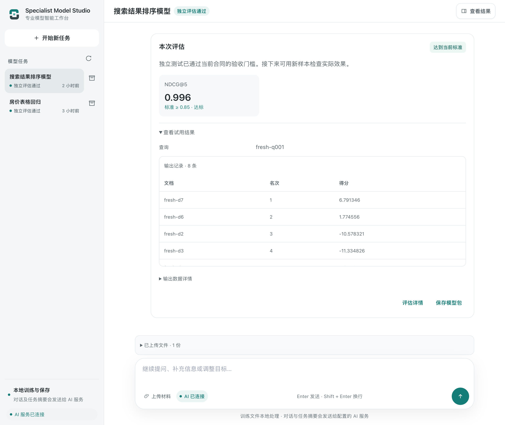
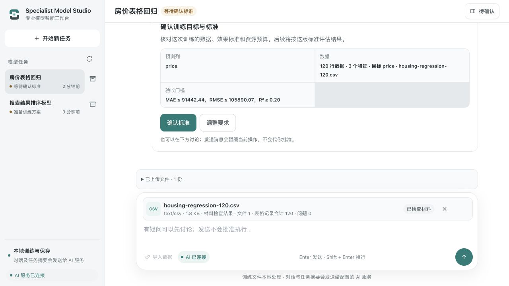
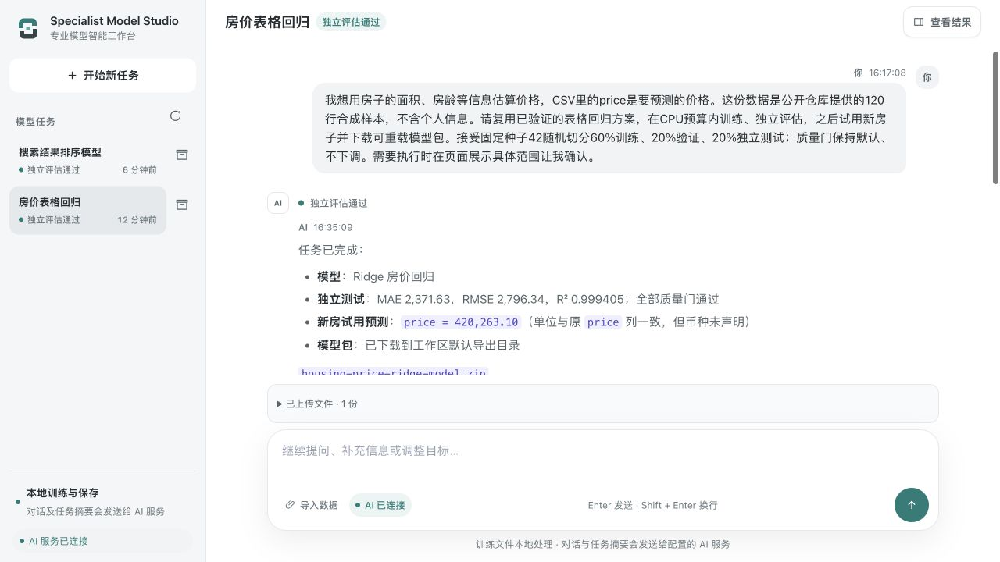

# Specialist Model Studio

**和 AI 一起，把一个模型需求做成可以试用的模型。**

先说说你想解决的问题。还没选好模型、没想清楚要不要微调，也可以从一份数据开始。AI 会检查材料、整理输入和输出，准备训练方案，再推进训练与测试。需要你决定的地方，会直接出现在对话里的确认卡上。

训练结束后，你可以在同一个页面输入新样本、看结果、保存模型包。任务、数据和结果会一起保留，方便回来继续检查。

[下载 v1.0.0-rc.2 源码预览](https://github.com/wanghui2323/specialist-model-studio/releases/tag/v1.0.0-rc.2) · [安装指南](docs/v1.0-source-release-candidate.md) · [发布与验收记录](plans/v1.0-conversation-native/RC2-RELEASE-20261007.md)



*真实验收页面，使用的是合成数据。训练、评估和新样本试用都在同一个任务里。*

## 从一个需求开始

你可以这样提出目标：

> 我有一批售后工单，想让模型分清退款、换货和物流问题。
>
> 我想识别工业标签上的文字，照片的字体和背景不太统一。
>
> 同一个搜索词下面有几篇候选文档，我想把更相关的结果排在前面。

Agent 会结合目标和材料，比较现成模型、微调、从头训练等路线。已经明确选了某条路线，就沿着它检查数据和资源；没有现成实现的目标，也可以进入代码准备与验证。

语音、OCR、NLP、时序只是一些例子，不需要先从系统预设的模型类型中选一个。


如果需要新写训练代码，会先在受限容器里验证。执行环境、数据或依赖有缺口时，页面会给出具体原因和下一步准备事项。

## 例子一：上传 CSV，试一个房价模型

这个例子使用仓库里的 [120 行合成 CSV](acceptance/fixtures/housing-regression-120.csv)，可以拿来熟悉流程。最开始的目标是用房子的面积、卧室数量和房龄预测 `price`。

你可以先这样描述：

> 我想用这些房屋信息估算价格，CSV 里的 price 是要预测的列。帮我准备一个小实验，训练后用新房子的信息试一下。

**1. 选择文件，先看数据有没有读对。** 页面会展示表头、记录数、缺失值和重复情况。AI 根据这些实际信息准备方案，不需要你先写训练脚本或填写电脑上的文件路径。

**2. 确认这次实验的标准。** 验收时读到了 120 行数据、3 个特征，训练、验证和独立测试分别使用 60%、20%、20%。确认卡会展示预测列和效果门槛；如果目标或字段理解有误，可以在这里调整。



**3. 训练结束后，用一条新输入试用。** 这次独立测试的平均绝对误差为 2371.63，通过了事先确认的门槛。我们随后在页面输入了未参与实验的新房信息：

```json
{"area_sqm": 100.5, "bedrooms": 3, "building_age_years": 12}
```

**4. 看预测，再保存模型。** 页面返回约 `420263.10` 的预测值，单位沿用原 `price` 列。保存的模型包包含模型、推理示例和评估证据；从下载包重新加载模型后，得到了相同的输出。



这是一份合成样本的实验，不能拿它给真实房产估价。换成自己的数据后，仍要重新检查样本、划分方式和效果标准。

## 例子二：没有现成方案，训练搜索排序

这个任务要求对每个查询下的 8 篇候选文档打分并排序。输入是 5 个数字特征，标签是人工相关度；查询和文档编号只用于标识记录。项目中没有现成的领域 Recipe（可复用训练实现）来完成它。

验收时，Agent 准备了按查询学习文档相对顺序的代码，在容器里完成验证，再请求启用方案和启动训练。训练、验证、独立测试使用了不同的查询组，分别为 80、20、20 组。

独立测试的 NDCG@5 为 **0.9964**，超过事先确认的 **0.85**。这个指标用来检查相关文档是否排在前面。接着，我们提供了一个全新查询，页面返回了 8 篇文档各自的得分和名次。

保存模型包后，又在新的断网容器里重新加载，输出与页面一致。这个案例展示了从准备新实现到实际训练、试用和交付的过程；具体任务能达到什么效果，还取决于数据、实现与可用计算资源。

## 在本地跑起来

需要 Git、Python 3.12、[uv](https://docs.astral.sh/uv/)、Node.js 24 LTS/npm，以及已启动的 Docker 兼容 Linux 容器服务。目前完整流程实测于 macOS + Linux ARM64 worker。

### 安装源码与依赖

```bash
git clone https://github.com/wanghui2323/specialist-model-studio.git
cd specialist-model-studio
git checkout v1.0.0-rc.2
uv sync --frozen --extra server --extra test
npm ci --prefix integrations/deepseek-harness --ignore-scripts
npm ci --prefix acceptance/dsh-runtime --ignore-scripts
```

### 准备训练环境

```bash
uv run python scripts/prepare_cpu_worker.py --configure
```

这一步会按固定依赖准备 CPU 执行镜像，不会把用户数据或模型权重放进镜像。已有执行环境、使用 Colima，或安装目录位于 iCloud 时，请先看[完整安装指南](docs/v1.0-source-release-candidate.md)中的配置说明。

### 连接 AI，打开工作台

以下是已经实测的 Codex CLI 路由，需要本机已有 ChatGPT 登录：

```bash
codex login status
export MODEL_HARNESS_AGENT_PROVIDER=codex-cli
export MODEL_HARNESS_AGENT_MODEL=gpt-5.6-sol
uv run specialist-model-studio start
```

终端会输出 Studio 的 `/app` 地址，打开即可开始。也可以配置 DeepSeek 或其他已安装的 DSH 服务适配器；更换服务后，需要确认真实对话和工具调用正常。

在页面上传数据、确认范围、训练后试用新样本。模型包默认保存到所选运行目录的 `_workspace/exports`。

## 这个版本的进度

`v1.0.0-rc.2` 已发布为开发者源码预览版（源码 RC），**不表示生产就绪**。目前验证了本地 CPU 容器中的训练流程，以及 Codex CLI / gpt-5.6-sol 协调路由。远程 GPU、其他服务的等价实测、环境完全自主构建、跨实验预算和完整训练检查点恢复仍在建设；停止过程提示和复杂数组输入也还需要打磨。

本次发布经过 GitHub 精确提交的冷克隆复验，上面两条流程都从新环境通过页面完成。三个桌面尺寸、进行中咨询的取消、刷新和服务重启也已验证。重启后两个 Run 和 24 个产物摘要保持不变，没有重复执行。

| 检查 | 结果 |
| --- | --- |
| 发布门禁 | 8 项通过 |
| Python | 926 项：924 通过、2 项条件跳过 |
| Node | 456 项通过 |
| npm audit | 0 告警 |

[查看发布回执](plans/v1.0-conversation-native/RC2-RELEASE-20261007.md) · [查看精确提交 CI](https://github.com/wanghui2323/specialist-model-studio/actions/runs/37592029010) · [下载脱敏验收附件](https://github.com/wanghui2323/specialist-model-studio/releases/download/v1.0.0-rc.2/specialist-model-studio-1.0.0-rc.2-acceptance.zip) · [SHA-256 校验文件](https://github.com/wanghui2323/specialist-model-studio/releases/download/v1.0.0-rc.2/SHA256SUMS)

平台流程完成和模型效果合格分别判断。[历史场景记录](plans/v1.0-conversation-native/OVERALL-ACCEPTANCE-20261006.md)中的语音/OCR质量失败、NLP否定语义反例及时序历史上下文限制，仍然保留。模型包排除原始数据文件，分享模型前还需检查模型状态、数据和权重许可。

## 继续了解与参与

- [通用训练怎样组织](plans/v1.0-conversation-native/ADR-002-GENERAL-TRAINING-EXECUTION.md)
- [长对话怎样保留任务事实](plans/v1.0-conversation-native/ADR-003-CONTEXT-RUNTIME.md)
- [安装、容器与服务配置](docs/v1.0-source-release-candidate.md)
- [提交问题或建议](https://github.com/wanghui2323/specialist-model-studio/issues)：说明版本、目标、操作步骤和脱敏现象即可，不要附密钥、私人声音或客户原始材料。

<details>
<summary>开发验证与运行时说明</summary>

```bash
uv run python -m unittest discover -s tests
npm test --prefix integrations/deepseek-harness
npm run check --prefix integrations/deepseek-harness
uv run python scripts/verify_project.py
```

功能轨道为 `v1.0-conversation-native`，运行时的 `source_preview_rc` 标记描述源码预览范围。当前 Python 为 `1.0.0rc2`，API/插件为 `1.0.0-rc.2`；[发布门槛](acceptance/v1.0-gates.json)与[发布记录](plans/v1.0-conversation-native/RC2-RELEASE-20261007.md)分别给出规则和证据。

三个内置的用户数据 Recipe 是图片目录分类、表格回归、表格分类；音频关键词分类（动态注册）也保留了原有验证路径。这些可复用实现方便起步，不限制 Agent 接受其他目标。

Python 依赖也可用 `uv pip install '.[server,test]'` 安装；固定版本复现采用上文的 `uv sync --frozen`。测试套件里的确定性复验检查协议行为，它不冒充真实 PID 重启；发布验收另外验证了实际服务重启。

普通 wheel 仅包含后端，`uv run specialist-model-studio serve` 是 backend-only 开发入口；完整 `start` 要求源码 checkout。`agent_required` 为 `false` 的演示不能代替真实 Agent 验收。

生成和第三方模型代码只在受限 OCI 容器里执行；没有已验证的隔离环境时，只允许静态分析。训练标准由用户确认，独立测试不用于选模型或改门槛。实验数据、下载权重、生成声音、凭据与 `runs/` 保持在版本控制之外。

</details>
