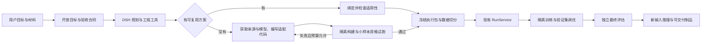

# ADR-002 · 恢复通用训练 Agent 的执行主路径

日期：2026-10-04。依据：用户本次明确的产品纠偏、当前源码审计、官方技术资料。状态：架构修复方案；不代表通用训练链路已经实现或验收完成。

具体函数位置、框架限制和协议映射见[技术审计附录](GENERIC-TRAINING-EXECUTION-AUDIT-20261004.md)。

后续实施采用[整体建设方案](GENERAL-AGENT-BUILD-PLAN-20261004.md)与[迭代看板](GENERAL-AGENT-ITERATION-BOARD.json)。其中R1将本ADR的数据、执行、评估、推理和页面作为一次完整交付，不能把各层底座分别完成当成产品闭环。

## 产品目标与偏差根因

v0.6 的 `plans/v0.6-execution/architecture-baseline.md` 已明确：两个真实场景是验收下限；没有现成 Recipe 时，由 Code Agent 实现、测试、注册，回到同一任务。这个目标继续有效。

实际偏差发生在分期落地中：隔离构建没有完成，RecipeFactory 被收缩为一个可信音频关键词配置引擎；后续 BYOM 补了来源、静态分析、计划和资源检查，却仍没有执行后端。页面、工具参数和任务路由逐渐把这一实现缺口表达为产品类型边界。已有场景的训练成功与未知场景的正确阻断被验证了，但“没有预设实现的新目标由 Agent 完成”的原始承诺没有被验证。

这不是换一句提示词、增加四个场景 Recipe，或移除失败保护可以修好的问题。隔离与版本校验应约束执行方式；任务的输入、输出和用户选择的训练路线应保持开放。

## 当前断点（源码核验）

| 层 | 当前事实 | 必要改造 |
| --- | --- | --- |
| 目标表达 | `task_specs.py` 原先只规范化已知 family；DSH 参数曾限制 modality/objective；未知目标可能反复确认 | 开放目标标识，记录输入、输出与训练路线。已知词表只是规范化提示 |
| Agent 工具 | `build_training` 有角色名称和领域工具，但没有通用代码写入、环境构建、隔离试跑与修正闭环 | 给它真实的工作区和工程工具；角色说明不能代替能力 |
| 扩展 | `recipe_factory.py` 只认 `sklearn_audio_keyword_v1`；`recipe_builder.py` 生成带 `NotImplementedError` 的脚手架 | 动态生成可审阅执行包，在隔离工作区编译、测试、失败修正 |
| 执行 | `workspace.authorize_v09_execution()` 最后无条件拒绝；`/runtime` 声明协议终止在资源检查 | 用真实资格证据连接同一 Task 的现有 RunService，不能直接删掉守卫 |
| 数据 | `verify_training_dataset_integrity()` 只认 CSV、图片分类、关键词分类 | 通用文件、schema、转换和 split 清单；领域校验来自当前方案 |
| 训练结果 | `runner.py` 依赖特定 Python 对象属性，并展示固定 accuracy/MAE 等字段；环境记录为宿主依赖 | 通用阶段结果、任意命名指标；记录实际 worker 镜像、代码与环境版本 |
| 推理 | `sample_inference.py` 和 `inference_inputs.py` 限定少数 Recipe/输入类型，未知模型没有执行协议 | 由冻结方案声明输入 schema/MIME/限额和预测入口；未知模型只在隔离环境加载 |
| 交付 | `evidence.py` 固定文件名白名单；部分路径默认 `model.joblib`；文件获取禁止嵌套 | 按冻结的产物角色、相对路径和 hash 交付分片权重、配置、tokenizer等；原始数据仍不自动导出 |
| 验收 | 既有场景和失败保护覆盖较多，通用构建成功路径缺失 | 四场景加一个未预设领域；核心代码不变，走同一页面和 Run 协议 |

## 决策：保留薄控制层，统一工程执行协议

保留 Studio 页面、DSH 协调器、TrainingWorkspace、ContractRevision、RunService、EvaluationReport 与产物授权。它们继续是唯一任务、批准和运行事实源。

Recipe 成为可复用的已验证执行包。宿主只运行可信桥接代码；生成代码、第三方训练代码、模型自定义加载代码在 worker 内执行。新场景不应要求修改核心 Python 类、前端类型枚举和全局文件名清单。

通用不等于保证任意模型在任意机器上成功。实际许可、数据质量、显存、依赖、训练失败等必须形成可定位事实和恢复动作；“目录没有这个类型”不构成业务拒绝。

## 最小跨进程协议

以下为设计合同，尚未全部落地。

- **GoalSpec**：原始目标、input/output 描述、训练路线、可接受误差或质量标准、时间/算力预算。保留用户明确的从零训练或微调选择。
- **ExecutionBundle**：source commit/tree/code digest、模型资产 hash、数据与 split 版本、环境镜像/依赖锁、prepare/train/evaluate/predict 入口、I/O schema、指标方向和冻结门槛、checkpoint/resume规则、产物角色与导出范围。
- **RunContext**：现有 task/run/contract identity、取消信号、事件写入口、工作目录、预算。不要另建一套独立 TrainingRun 状态。
- **StageResult**：执行身份、真实退出码、实际设备和环境、耗时、日志位置与是否截断、命名指标、产物清单及 hash。缺失、失败、质量不达标与观测降级保持不同状态。
- **PredictionEvidence**：新输入身份与 hash、选定模型制品 digest、预测入口版本、结构化输出或音频/图片等产物引用。

准备环境可以联网取得公开代码与依赖；携带私有训练数据的执行环境默认断网。源站访问和下载权限应绑定具体来源、版本与文件范围。Agent 的控制密钥不能进入训练容器。

数据准备与实验阶段分开。训练/调优 worker 只挂载 train/validation；最终 test 由评估阶段单独读取。指标门槛由控制层按冻结规则核算，不能仅接受训练脚本自报 `all_passed=true`。模型选择只使用验证证据。

资格试跑至少检验：入口可执行、输入输出合同、一次真实参数更新或符合目标的拟合、无效数据失败行为、checkpoint 保存/恢复、模型重新加载与预测、时长与峰值资源观测。一次小样本通过只证明该方案可执行，不证明最终模型质量。

## 官方资料与方案取舍

| 方案 | 官方确认的能力 | 对本项目的建议（工程判断） |
| --- | --- | --- |
| [SWE-ReX](https://swe-rex.com/latest/architecture/) / [部署配置](https://swe-rex.com/latest/api/deployments/config/) | Deployment 与 Runtime 分离，提供文件、命令、交互会话，支持 Docker/Podman、远程及 Modal 等部署 | 优先比较其工作区接口与当前受限 OCI runner；封装统一 RuntimeAdapter。LocalRuntime 本身不提供隔离，不能在宿主直接运行未知代码 |
| [OpenHands SDK](https://docs.openhands.dev/sdk/arch/overview) / [Agent Server](https://docs.openhands.dev/sdk/guides/agent-server/overview) | 代码工具、工作区、远程 Agent 服务及事件交互 | 可作独立编码执行器候选。当前保留 DSH，避免同时引入两套会话、批准和完成判断；先验证工具层复用价值 |
| [Hugging Face Hub](https://huggingface.co/docs/huggingface_hub/en/guides/download) | 按 revision 获取文件/快照，筛选所需文件 | 复用固定 commit 与下载缓存机制；把模型权重、配置和 tokenizer统一为资产，不限 ONNX 图片特征 |
| [Accelerate](https://huggingface.co/docs/accelerate/en/index) / [Checkpointing](https://huggingface.co/docs/accelerate/en/usage_guides/checkpoint) | 帮助 PyTorch 训练在不同设备配置启动；保存恢复模型、优化器和运行状态 | 作为 PyTorch 任务执行包的可选依赖，不作为平台全部任务的共同基类 |
| [Ray Tune](https://docs.ray.io/en/latest/tune/key-concepts.html) / [恢复](https://docs.ray.io/en/latest/tune/tutorials/tune-fault-tolerance.html) | Trainable、试验调度、提前终止与checkpoint恢复 | 多实验并行或多节点时按需引入；不能替代 OCI 文件/网络隔离和强制超时 |
| [MLflow Models](https://mlflow.org/docs/latest/model) | 模型 flavor、自定义 Python 模型、输入输出签名、依赖与产物封装 | 借鉴模型签名和产物合同，支持可选导出；暂不再建第二个任务/Run事实源。自定义模型加载仍在worker内 |
| [AIDE](https://github.com/WecoAI/aideml) | 围绕代码草拟、调试、验证反馈进行迭代搜索 | 借鉴有限预算的实验改进循环；不照搬无约束搜索或把“代码运行成功”当成用户质量验收 |
| [MLE-bench](https://github.com/openai/mle-bench/tree/main/agents) | 检验 ML Agent 的完整执行，并有私有测试数据不可读检查 | 借鉴独立评分与数据隔离的验收设计，不把benchmark结果外推成本项目已支持任意任务 |

不建议现在整体迁移到另一个 Agent 框架，或先引入完整分布式训练平台。当前最缺的是贯通已有控制层的工程工具和跨进程合同，不是更多角色名称。

## 减少等待与无效交互

1. 协调器先回答已知需求并推进可执行动作；只询问会改变路线、预算或验收的缺失决定。
2. 专家按需调用，不让每个简单问题强制串行经过所有角色。只读来源、材料、资源探测可以并行；依赖和批准操作保持顺序。
3. 模型/依赖缓存以不可变摘要为键。已验证方案按 goal/route/data schema/environment 匹配，不能仅凭 modality 命中。
4. 长训练是持久作业，独立于一轮聊天；页面显示真实阶段、最近日志和停止操作。刷新或 Agent 断线不等于模型训练停止。
5. 先短资格试跑测资源，再估算正式训练；估算标明假设。调优在预算内迭代，冻结目标与最终测试规则不变。

## 落地顺序与完成标准

| 顺序 | 实施范围 | 验收证据 |
| --- | --- | --- |
| 1 | 开放 GoalSpec；移除页面/提示词的类型边界；保留路线 | 未枚举领域可建任务、刷新保留输入输出和路线；不能偷换已有方案 |
| 2 | 通用工作区：来源/文件/环境构建/执行/日志/取消 | Agent生成陌生任务代码→真实隔离执行→修错复跑；凭据、宿主文件和test不可读；取消与超时清理 |
| 3 | 通用Data/Split/ExecutionBundle与可信Recipe桥接 | 不改核心新增领域，经过现合同与RunService，真实Run身份、事件与重启恢复一致 |
| 4 | 通用评估、模型重载、推理和产物合同 | 模型重载结果可核对；任意声明指标由冻结门槛核算；新文件输入通过页面上传并得到结果 |
| 5 | 四场景＋一个此前未枚举领域的页面验收 | 用户对话→上传→方案→批准→真实训练→评估→新输入→下载；失败收集与修复复验 |

明确禁止将 inspect材料、脚手架、模拟transport单测、容器hello-world或静态资源检查标成通用训练完成。

## 本轮已改与尚未验证

- 已改：开放family/objective参数；保存input/output/training_route；显式路线不再命中未声明该路线的缓存Recipe；咨询策略与页面将未匹配目标带入方案准备。
- 已新增：任务无关的受限OCI阶段执行器核心及测试。它目前还没有连接到产品批准、RunService和通用推理链路，不能据此标记 `byom_execution_available=true`。
- 本地已安装 Colima/Docker，独立的 specialist-model-studio 虚拟机已启动，只挂载专用任务目录，不改变默认 Docker context。固定 Python 镜像内的真实 worker 集成已通过：8 项隔离探测、合成数据参数拟合、独立评估、模型重载新输入预测、超时清理。证据在 `runs/acceptance/20261004-generic-worker/real-oci-evidence.json`。这是工程师编写的执行器验收脚本，不是 Agent 自主实现或页面 TrainingRun；代码生成闭环、四场景训练与第五个未知领域尚未验收。
- 本轮全量回归：Python 753 项、Node 343 项通过。这些测试不等同于通用训练的页面验收。
- 现有历史运行、合同与测试证据保留。没有发布、推送或改变原始验收阈值。
