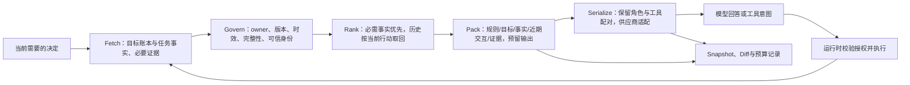

# 通用训练 Agent 的上下文管理策略

状态：设计与首批修复；不表示全部机制或长对话验收完成。

依据：用户之前的第11篇《资料都接入了，AI为什么还是会答错？一文讲清 Context Engineering》，当前原稿位于 `/Users/wanghui/Library/Mobile Documents/com~apple~CloudDocs/Documents/AI写作空间/series/ai-pm-tech-foundation/article11/draft.md`。沿用文章的 `U_t / C_t / S_t`、`Fetch → Govern → Rank → Pack → Serialize` 和四层评测。文章中的75%是初始假设，不能直接当行业标准。本文把这些原则落到本项目；文章正文保持不变。

## 1. 当前问题与已有基础

已有：DSH完整会话记录与原生压缩；`TrainingTask`、`ContractRevision`、Run、评估、预测和制品的版本事实；`root_context()` 与 `conversation-context.js` 在提交和工具循环时读取当前身份、材料、数据和停止状态；大源码在任务读取视图中外置；同一子会话的精确重复通知合并。

缺口：旧工具结果和专家长通知持续占窗口；当前事实快照还不是完整的目标/决定账本；工具结果缺少统一的可分页读取；输入装箱没有独立、完整的Snapshot/Diff；角色交接仍可能复制大段代码；摘要请求本身没有独立预算与分段恢复。模型接入、SDK压缩与业务事实刷新之间缺少共同预算合同。

本次时序原任务真实失败：750,000字节的路由输入保护触发后，DSH的摘要请求也触发同一限制。不是训练Run或文件丢失。检测到的一个原因是旧配置为每条长工具结果保留约28K字符，几十条历史结果累计占满摘要输入；降低单条保留量后仍存在大量历史消息，所以还需工作集装箱，而非只改阈值。

已修复的基础：路由明确128K的**运行预算**（不是声称底层模型最大容量），超限使用原生 `CONTEXT_WINDOW_EXCEEDED` 恢复协议，历史工具保留量回到8K触发/4K头/1K尾。新增 `model-context.js` 提供供应商无关的临时工作集投影，当前先接到CLI适配器：旧的大工具正文和机器通知外置为摘要/引用，完整原文仍在日志中；用户原文、近期消息、工具调用配对及图片保留；摘要调用不提供执行工具。不能据此声称所有API适配器已经接入或长对话一定不会失败。

## 2. 系统对象和唯一事实源

| 对象 | 本项目内容 | 是否常驻每次请求 |
|---|---|---|
| 候选池 `U_t` | 用户历史、任务各版本、当前材料、源代码、模型卡、日志、工具定义、专家产物 | 否；可获取不等于应该装载 |
| 窗口外状态 `S_t` | TaskSpec/合同/数据/Run、批准与消费记录、原始对话、完整日志与文件 | 持久保存，模型摘要不得覆盖 |
| 本轮工作集 `C_t` | 当前决定所需规则、目标/选择/约束、当前事实、近期对话、必要证据与工具 | 经预算装箱后进入请求 |
| ContextSnapshot | 本次装载与排除清单、来源/版本/完整性、预算、真实序列化摘要、策略版本 | 为诊断持久化，默认不出现在主对话 |

模型摘要不是另一份Task状态，也不是批准凭据。压缩后是否可训练、是否取消、指标是否通过，都重新由当前确定性服务判定。

## 3. 信息分层

| 层 | 内容与来源 | 进入/失效规则 |
|---|---|---|
| 稳定规则 | 通用产品职责、执行隔离、事实与授权规则、共享对话策略 | 精简常驻；稳定前缀有版本，避免每轮重复注入 |
| 用户意图与决定 | 原话、目标/输出、路线、约束、待澄清项、已回答事项 | 当前项必须保留；区分用户明确选择、Agent建议和暂定假设；变更保留原话与来源版本 |
| 当前确定性事实 | Task/Spec/合同/数据/Run/评估/试用/包及停止状态 | 每次重要动作前重读；按owner与版本校验，读取失败不解释为“没有” |
| 近期交互 | 当前用户消息、对它必要的上一轮回复、未完成工具调用与结果 | 原文保留，不能拆断工具配对；最近失败的诊断与未决问题不能因年龄直接丢弃 |
| 阶段证据 | 当前源码片段、数据规格、日志错误窗口、模型来源与资格报告 | 按当前决定加载；引用绑定对象、摘要、范围与读取入口，分页结果标明完整性 |
| 历史工作摘要 | 已做事项、关键决定、失败/未决项、下一步和证据引用 | 增量/分段处理，不一次重读全部历史；是导航，不能当作实时事实或原始源码 |
| 跨任务经验 | 公开实现经验、已验证方案与环境信息、用户明确允许保存的偏好 | 当前目标相关时取回；不默认带入其他任务私有材料或旧批准 |

初期优先结构化字段、对象ID和精确检索，不为解决单任务历史溢出先建立向量数据库。公开知识检索与当前任务事实读取是两条链；语义相似不能覆盖版本或授权关系。

## 4. 每次模型调用的组装链



DecisionContract先区分当前是咨询、查看上传、工程诊断、确认标准、启动训练、解释评估、试用或下载。用“当前要解决哪一个问题”选证据，不用语音/OCR等业务family划定上下文或能力范围。尚未明确需求时保留用户原话，记录可逆假设；只有改变紧接着动作的问题才澄清。已经回答过的事项进入决定账本，不反复提问。

ContextBuilder接口建议：

```text
build_context(decision, owner, current_request, task_state,
              candidate_refs, role_scope, provider_budget)
    -> working_set, snapshot, excluded_items, unresolved_required_items
```

`snapshot`最少记录：task/session/turn/call、当前Spec/合同/数据/Run身份、策略版本、模型路由及预算来源、每个已装载对象的摘要/范围、排除原因、输入估算/实际用量、输出预留、前后Context摘要。正文或源码外置时明确 `reference_only`，不能让投影对象参与原始代码/合同摘要计算。详细诊断在证据视图，主对话只解释当前进展、必要决定与结果。

## 5. 预算和长期维护

输入预算由供应商适配器的实际模型能力、产品配置的工作预算、输出预留和安全余量共同决定。字节保护是传输保护，不等于Token容量；中文、代码、工具Schema、图像和媒体分别计价。模型容量不明确时使用可配置的保守预算，并标记估算来源。

候选策略：接近工作预算60%先去重/外置可回查结果，75%进行增量摘要，90%前完成整理或把任务拆成可恢复阶段。这些比例是待测配置；要用当前真实请求、摘要成功率、意图保真、成本与延迟校准，不写成固定行业门槛。

整理顺序：精确去重 → 外置长日志/代码与旧结果 → 阶段摘要 → 按需取回历史 → 分段摘要/隔离任务。关键事实仍装不下时明确保留可接续状态并停止该项判断，不能静默删除用户目标、预算或质量门继续执行。

摘要器是独立的只读任务：有输入/输出/耗时预算，没有产品执行工具；每段按平衡的工具配对或阶段边界切分，生成引用化摘要，合并时保留来源和未决冲突。摘要失败时保留原记录和已完成分段，恢复当前Task事实与近期交互，禁止无界重试。结构化目标、当前事实、批准状态由确定性存储恢复，不能只依赖摘要模型“记得”。

## 6. 专家交接和模型服务替换

专家接收 `task_id + 当前目标/路线 + 具体子目标 + 输入refs + 固定版本 + 有效阶段预算 + 验收要求`，不用完整主聊天和每个前任专家的长输出。专家返回结构化结论、真实产物/报告ref、失败原因、未决项；大段源码和日志保留任务工作区，按需读取。

统一策略属于产品运行层。供应商适配器负责消息角色、工具协议、图像和取消等序列化及能力差异；CLI、本地服务、兼容接口和其他API都应采用相同的目标与事实合同。供应商自己的有状态会话ID只能是传输层引用，不能替代产品task/run身份；模型切换后依据Task事实和ContextSnapshot重建工作集，不继承旧服务无法验证的隐式记忆。Prompt Cache用于计算复用，不作为业务状态保存手段。

## 7. 分层验收与实施顺序

还要区分两种上下文：对话模型的工作集，与被训练模型预测时依赖的输入状态。时序试用中的57天过期历史属于后者；把聊天摘要整理好不会修复它。预测上下文必须在Execution/Prediction合同中声明来源、时间范围、单位、覆盖与必要字段，在资格和新输入阶段实际核验。需要新的合法历史时通过页面上传和同一输入授权绑定，不能从聊天记忆“补齐数据”，也不能把受保护测试材料自动挂进预测工作区。

| 层 | 核验问题 | 具体反例 |
|---|---|---|
| Retrieve | 该取回的目标、当前版本和证据是否取到 | 查询降级/分页、旧Run、错误owner、实际材料已到但断言没有 |
| Assemble | 必需项是否进入实际请求；旧内容是否外置且可回查 | 用户明确从零被摘要成微调、预算/否定丢失、代码截断后当成完整代码、失效批准仍装载 |
| Utilize | 证据充分时能否稳定使用；缺失时能否指出缺口 | Oracle、No-evidence、位置/噪声/长度、摘要前后同目标对照 |
| Outcome | 页面和实际任务是否完成正确工作 | 原时序长对话继续下载、不重训；额度/模型切换；取消后不自动继续；保持质量失败；干净环境重载 |

P0先闭环当前长对话反例：统一临时工作集投影、摘要预算、真实输入trace、保持原任务的页面续接。P1补齐Goal/Decision Ledger、范围读取、ContextSnapshot/Diff、摘要保真回归和独立事实校验。P2完善分段摘要、阶段交接、按需工具Schema和跨模型恢复；再按实测需要加入检索与跨任务经验。

已实现/未完成必须分开报告。第一批工作集投影与相关单元测试已经落地；真实长对话是否完成下载以新的页面证据为准。当前尚不能宣称完整的Context Runtime、全供应商接入或全部测试覆盖已经完成。

2026-10-06首轮实测更新：当前原时序任务成功产生原生摘要后的正常模型调用，再次展示了已有 `bundle-70dc24f48f68` 的下载批准；没有另建任务或重训。路由trace记录摘要实际文本输入428,391字节、其后第一次正常调用184,818字节。已通过页面提交该已有包的下载批准；最终保存回执另行核对。这是一个真实恢复样例，不代表所有压缩保真条件或全部场景已经通过。
