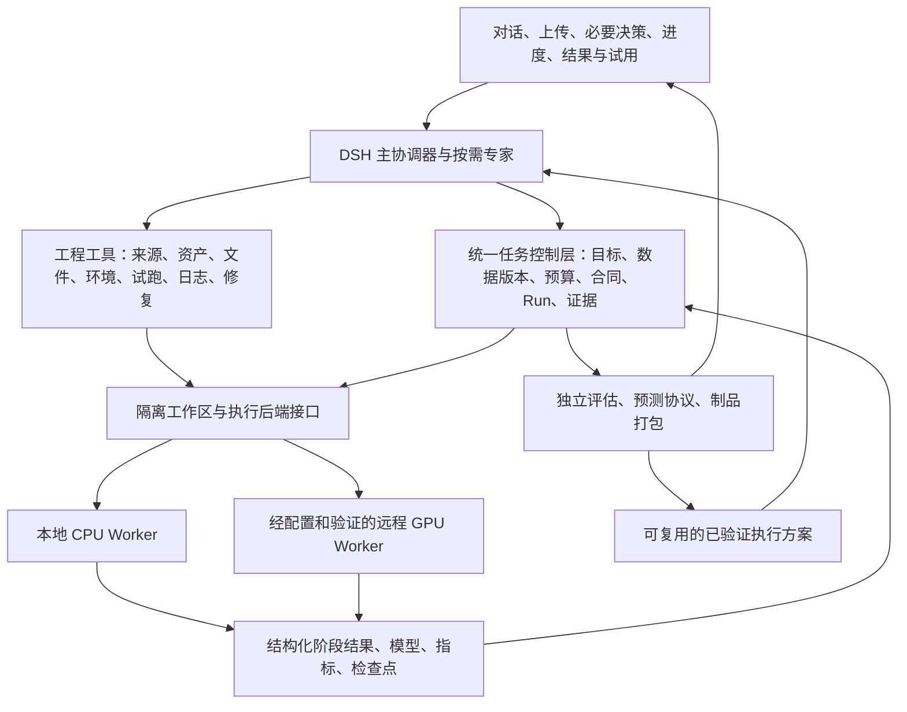

# 通用模型训练 Agent · 整体建设方案

日期：2026-10-04。状态：建设方案与迭代验收合同，不是功能完成报告。

本方案承接 [ADR-002](ADR-002-GENERAL-TRAINING-EXECUTION.md) 与 [源码和技术方案审计](GENERIC-TRAINING-EXECUTION-AUDIT-20261004.md)。后续迭代围绕本方案推进；历史版本的场景范围不作为产品能力白名单。

最新状态以 [2026-10-06 整体验收记录](OVERALL-ACCEPTANCE-20261006.md) 和迭代看板为准。以下为原始建设方案，不把本地五个流程收尾等同于完整建设完成。

可执行工作项和依赖记录在[迭代看板](GENERAL-AGENT-ITERATION-BOARD.json)。当前 R1 开发与页面验收进行中，R2–R5 尚未验收；没有里程碑标记为完成。

## 1. 产品目标

用户表达目标、提供数据和可用资源，Agent 负责澄清必要决策、寻找模型和代码、准备数据与环境、实现训练方案、运行与调优、评估并交付可试用的模型。

平台承诺一条持续推进且可验证的通用工程路径。模型类型用于理解输入、输出、算法和评价要求；是否存在内置 Recipe 不决定是否接受需求。失败必须落到当前任务的具体原因，例如某个依赖构建失败、实测显存不足、数据不满足某项要求或效果未达标，并带下一步动作。

通用能力由标准工具、工程协议和验证机制组成。已有 Recipe 是可复用资产；领域知识、训练库、模型结构和数据转换可以由 Agent 按任务选择、生成或适配。

### 用户应得到的完整体验

1. 描述希望模型完成的事情；已有明确路线时保留该路线。
2. Agent 给出具体实现路径、数据规范、资源依据和小规模验证方式；只问会改变下一步的必要问题。
3. 用户在页面上传材料。Agent 直接检查、转换和生成可用数据，不要求用户自行编写适配器或输入本机路径。
4. Agent 获取固定版本的公开代码、模型和依赖，完成隔离试跑及预算内修错。
5. 用户查看目标、数据、训练方式、预算和验收指标后批准正式实验。
6. 页面展示真实执行阶段与结果；可以补充消息、查看日志、停止、刷新和恢复。
7. Agent 依据验证集比较候选；选定实现后做独立最终评估。
8. 用户上传全新输入试用，查看文字、数值、图片或音频等真实输出，并下载完整可重载制品。

通用链路成立与某个模型效果达标分别验收。小数据跑通不能证明业务效果；实际质量不达标也不应被伪装成系统不支持这个领域。

## 2. 当前起点

已具备：对话与材料上传、目标记录、HF/GitHub来源研究、不可变版本与审批、现有Recipe训练、运行事件、部分评估/推理/交付能力。

已修正但仍须整体复验：开放目标与训练路线表达；目录未匹配进入方案准备；减少重复上传、重复询问和技术提示。

已验证的底层：通用 OCI 阶段执行器在本机真实容器内完成隔离探测、合成数据拟合、独立评估、重载预测、超时清理。开发分支已将它接入任务所属提案、资格、同一 Run、评估、新输入与制品协议；完整页面流程尚未验收。

方案起草时 `/runtime` 协议止于资源检查，回归记录为 Python 753 项、Node 343 项。后续开发已加入 `qualified_isolated_training_and_inference` 协议；它表示执行桥接入口，不表示任何未知任务都已验证或效果达标。新测试和页面发现以当前验收记录为准。

## 3. 总体架构

### 保留、改造与新增

| 处理 | 内容 | 原因 |
| --- | --- | --- |
| 保留 | DSH协调、TrainingWorkspace、ContractRevision、RunService、任务身份、事件和授权证据 | 避免引入第二套任务状态与完成判断；旧任务和现有训练继续可用 |
| 改造 | 目标匹配、Dataset导入、Recipe接口、runner、评估门槛、样例推理和产物清单 | 清除“类型、格式、指标、文件名”在核心链路里的固定假设 |
| 新增 | 任务工程工作区、代码版本、环境准备、资格试跑、可信通用执行桥、实验预算与恢复协议 | 让Agent能从没有现成实现走到真实训练 |
| 后续按需接入 | SWE-ReX/OpenHands工具层、Accelerate、Ray、MLflow、远程算力 | 作为可替换执行/训练/交换组件，不替换产品事实源 |

短期先使用已有OCI执行器完成产品链路。运行后端通过统一接口接入；引入SWE-ReX等组件前，比较取消、会话恢复、文件传输、身份映射和维护成本，不先整体迁移Agent框架。PyTorch任务按需使用Accelerate；并行实验、多节点需求出现后再接Ray；MLflow先作为可选交换或跟踪接口。

## 4. 七项标准能力

### 4.1 需求与方案

GoalSpec保存原始目标、输入输出、明确训练路线、评价要求、数据/算力约束与尚未确定的事项。路线建议和用户选择分开保存。推理复用、微调和从零训练可以比较，但不得悄悄替换用户选择。

需求足够明确时直接推进。数据是否已经准备好，不阻止先提供规格与准备方法。机器信息能读取就读取；低风险可逆假设应说明后继续；真正改变预算、路线或验收的决定才交给用户。

### 4.2 模型与代码获取

统一来源发现、兼容性分析、版本固定、许可证核对、文件选择、下载校验和缓存。代码许可、模型权重许可和数据使用要求分别记录。

ModelAsset包含权重、配置、tokenizer、词表、预处理和基座依赖等实际文件。不能把“搜索到仓库”“模型卡说支持”当成模型已经可训练。固定版本后，资格试跑确认输入输出、训练参数更新和资源需求。

### 4.3 数据管理

上传材料与训练Dataset分层，但用户不需要理解内部对象名称。材料保持原始内容；Agent在隔离工作区生成转换程序、样本清单和数据报告。正式Dataset绑定原始材料、转换版本、schema及完整摘要。

SplitManifest冻结样本身份、train/validation/test归属及按时间、主体或组切分的依据。训练与调优只能访问train/validation；最终评估阶段单独取得test。单个CSV内部划分也要形成可验证的样本索引，不能只保存随机种子。

同一文件的重复上传、丢响应、刷新和切换任务通过现有回执恢复。重复清单、格式转换等工程工作由Agent处理，不能默认要求用户删文件、改目录或重打包。

### 4.4 工程与环境

Agent可在任务专属工作区读写代码、读取固定来源、准备依赖、启动受限命令、读取真实日志、修正并重试。每次变化生成不可变版本和父子关系，不覆盖已有运行证据。

环境准备与私有数据训练分开：前者在受限来源范围内下载依赖与公开资产；后者默认断网。未知代码不在宿主执行，工作区不取得控制服务密钥或任意宿主文件。

Qualification验证入口、数据转换、真实拟合或参数更新、失败样本处理、模型保存重载、预测合同、资源观测和必要的checkpoint恢复。试跑通过只授权该版本进入后续确认，不代表模型质量已经通过。

### 4.5 训练与调优

统一执行包绑定代码、模型、数据、环境、阶段入口、指标和制品规则，通过可信桥接进入现有RunService。worker只返回结构化结果，不向宿主返回可执行模型对象。

调优循环包括：形成假设、提出参数或代码变更、资格验证、执行候选、读取验证指标、保留更优候选、继续或停止。总时长、试验次数、算力、费用和失败重试受实验预算约束。效果没有提升也是有效结论，不能强行生成“优化成功”。

### 4.6 评估、试用与交付

EvaluationSpec声明指标、方向、阈值、评价单位和证据充分性。例如文件、句子、字符、预测窗口的样本单位不同，不能统一套用固定分类阈值或固定样本数。

控制层依据冻结指标规则核算结论，不直接接受训练脚本自报的通过布尔值。最终测试程序、数据和代码摘要进入报告；测试集不得参与候选选择。

PredictionSpec声明输入schema、媒体类型、大小、预处理、预测入口和输出形式。新输入通过页面上传并取得独立身份；模型在冻结环境内重载。

ArtifactManifest按文件角色、相对路径、依赖和摘要交付。支持分片权重、配置、基座/adapter关系与推理代码；原始数据、测试参考、私有日志和凭据不自动打包。下载包必须能在干净环境重载。

### 4.7 持久作业与算力

模型训练独立于一轮聊天，Agent断线和网页刷新不应丢失训练身份。持久作业记录队列、阶段、心跳、取消、失败与恢复引用；停止需要落实到真实进程。

本地CPU先跑通。远程GPU后端使用同一输入输出和事件协议，在实际设备上测显存、吞吐与恢复能力。检测到GPU不等于可用；小批量实测与带假设的预算估计共同决定启动配置。

平台的AI服务配置与训练模型资产分开：前者为协调器提供推理，后者是用户要训练的模型。密钥通过明确的凭据配置管理，不放进聊天、训练合同或worker镜像。

## 5. 通用接口与唯一事实源

| 对象/接口 | 最小合同 |
| --- | --- |
| GoalSpec | 目标、输入输出、路线、指标、约束、未决事项、revision |
| DataManifest / SplitManifest | 原材料、转换版本、schema、样本身份、分组/时间规则、完整摘要 |
| ModelAsset / EnvironmentRevision | 固定来源、实际文件及依赖、镜像与依赖锁、实测资源和设备 |
| ExecutionBundle | 上述身份与摘要，prepare/train/evaluate/predict入口、I/O、预算、checkpoint、产物声明 |
| QualificationEvidence | 实际执行、正反输入、模型重载、资源与错误证据；绑定精确版本 |
| RunContext / StageResult | 唯一task/run身份、事件、取消、预算；真实退出、指标、检查点和产物引用 |
| ExperimentBudget | 有效范围、总额度、已用额度、候选/重试计数、停止原因与父子谱系 |
| Evaluation / Prediction / Artifact | 冻结评价规则、独立新输入、模型集合摘要、结果与可导出文件 |

执行器自己的stage记录是Run的执行证据，不能另立一个“训练已完成”状态源。对旧Recipe提供兼容桥；未知领域通过执行包扩展，不能动态安装任意宿主Python插件。

## 6. 自主推进与必要决策

| 工作 | 用户交互原则 |
| --- | --- |
| 阅读已上传材料、读取机器信息、公开来源研究、形成候选方案 | 在用户任务范围内直接推进，不逐项问“是否继续” |
| 工程准备和修错 | 以任务工作区、来源/材料范围、资源与次数预算建立准备授权；范围内修错不重复问用户，每次保留代码摘要 |
| 首次正式训练 | 一次展示目标、路线、数据、指标、预算和最终实现范围；沿现有合同和Run批准机制启动 |
| 多轮调优 | 后续引入实验范围授权；每轮冻结版本并校验仍在已批准范围内。超预算、改变目标/数据/test或扩大权限才重新决策 |
| 新样本试用、导出或下载 | 复用现有精确绑定授权；界面减少重复解释，不把上传当作运行或发布批准 |

实施前同步调整AGENTS、persona、工具权限和后端状态守卫。历史“Agent不能自主生成修复patch”的规则要明确迁移为“可在已批准的隔离工作区与预算内生成修订版本；不得改写验收、覆盖证据、越权或在宿主执行”。规则迁移须与对应授权和执行校验一起落地，不能先删除保护再等待实现。

## 7. 对话与页面建设

一个主对话负责连贯的目标与结果，专家按需调用。独立的只读分析可以并行；有依赖的构建、批准与执行保持顺序。页面不展示没有实际工作的角色。

主界面围绕目标、材料、方案、实验、结果和试用组织；技术细节折叠展示。操作反馈优先附着于文件、消息或运行本身。没有额外信息的“已发给AI”提示删除；消息排队状态只出现在相应消息上。

首个有用回复应给出具体发现、可执行方案或必要决定。“正在理解”不计为有用反馈。对实际长任务展示当前真实阶段、日志、耗时和停止入口，未知进度不显示虚构百分比。

界面按输入输出schema和媒体类型呈现，避免“新增领域就新增一个页面分支”。并持续验证任务切换、草稿、上传中断、审批取消、错误恢复、刷新和不同PC宽度。

## 8. 迭代路线

每一轮交付完整用户结果。工程工作可并行，里程碑只能在页面验收通过后完成。

| 轮次 | 用户得到什么 | 本轮建设重点 | 退出标准 |
| --- | --- | --- | --- |
| R1 首个通用闭环 | 一个没有预设Recipe的明确目标，由Agent从页面做到模型试用和下载 | 最小通用数据/执行协议、Agent代码工具、OCI资格、可信桥接、同一Run、通用评估/推理/制品 | Agent实际生成实现并修复一次工程错误；完整页面链路通过，验收中无人工补脚本/命令 |
| R2 开源模型与环境复用 | Agent能取得实际模型资产、处理依赖，保留用户选择的微调或从零训练路线 | 固定来源与权重、可重建环境、兼容性试跑、缓存、基座/adapter依赖 | 至少一次真实预训练参数更新和一次明确随机初始化训练；重复环境可重建，故障依赖可诊断恢复 |
| R3 自主实验与恢复 | 用户给定预算，Agent能比较候选、改进、停止并恢复工作 | 实验范围授权、验证集反馈、候选/失败谱系、checkpoint和持久作业 | 实际改进或如实保留原候选；不越预算、不碰最终test选模；停止/服务重启后不重复启动、不丢身份 |
| R4 算力扩展 | 同一任务可在经配置的远程GPU上执行 | RuntimeAdapter远程实现、资产传输、设备资格、实测预算、远端日志/取消/恢复 | 至少一个真实GPU任务完成训练和模型重载；端到端哈希、费用/资源范围和取消可核验 |
| R5 产品与发布验收 | 用户可独立使用通用流程，知道结果达标与否 | 四场景、隐藏新领域、对话与组件复验、安装与文档、清洁环境重载 | 下述矩阵通过；发布声明与真实能力一致，阻断不计作成功闭环 |

R1可以约束为单机、单worker、已验证镜像和小预算；约束执行规模而不限制业务family。R1的目标在通用接口冻结后选定。R5再使用不同的隐藏目标复验，防止R1任务形成隐性特例。

四场景从早期就作为回归样本；到R5才汇总完整验收，不能最后才检查它们的需求是否能被协议表达。远程GPU的实际环境和授权在R4需要时提供，不阻塞R1本地建设。

### R1的七项工作必须作为一次完整交付

| 工作项 | 交付物 | 依赖 |
| --- | --- | --- |
| W1 验收标尺 | 页面脚本、独立评判、数据切分、全新输入和一个可修复工程故障；具体隐藏任务在接口冻结后揭示 | 无 |
| W2 通用合同 | Dataset/Split/ExecutionBundle/StageResult最小实现与合同漂移校验 | W1的通用验收规则 |
| W3 Agent工程工具 | 同task读写代码、资格执行、日志、修正、版本谱系；来源/环境首轮采用明确的已验证配置 | W2、现有OCI底层 |
| W4 唯一Run接入 | 可信OCI桥、RunContext、实际事件、取消与失败状态 | W2；与W3并行 |
| W5 评估与交付 | 独立测试、host门槛核算、模型集合摘要、通用预测与可重载包 | W2；与W3/W4并行，集成依赖W4 |
| W6 页面与对话 | 上传、方案、批准、真实进度、评测、新输入、结果和下载 | W2接口；与W3/W4/W5并行 |
| W7 全链验收与修复 | 页面真实Agent运行、故障恢复、停止/刷新、干净环境重载证据 | W3+W4+W5+W6 |

首轮统一完成条件：W7通过。W2协议完成、W3单测通过、worker能运行，均不能单独称为R1完成。

## 9. 验收矩阵

| 用例 | 必须保留的目标与验证 |
| --- | --- |
| 语音 | 用户选从零训练则保留；文本到音频，真实训练权重与新文本音频输出。不得用关键词分类、ASR或系统合成音替代。流程通过、可懂度/音色质量分别判定 |
| OCR | 输入单行图像，输出完整字符串；预训练模型微调，CER/整行准确率与新图片识别，不偷换图片类别预测 |
| NLP | 中文售后六分类，真实预训练文本模型参数更新；独立测试与新文本预测，不能把TF-IDF当预训练微调 |
| 时序 | 三家门店未来七天逐日预测；时间顺序/分组切分、多步评估与新历史窗口，不能随机打散当普通回归 |
| 隐藏新领域 | 冻结版本后提供不同输入输出目标；允许Agent生成任务工作区代码，但不得修改平台核心、补人工专用脚本或加入提示词特例 |

每个用例按四个维度分别记录：对话是否顺畅、流程是否由Agent完成、证据是否可信、效果是否达标。样例数据只能证明其覆盖范围；正式效果需合适的数据规模和评价条件。

人只通过页面表达目标、上传材料、作必要决定和体验结果。人工终端训练、人工修改Agent脚本、补制品或替Agent调用后端完成步骤，均记为该次Agent流程未通过；修复平台后用新会话重跑。

### 每轮共同指标

| 指标 | 验收办法 |
| --- | --- |
| 无效澄清与重复索取已有信息 | 标注每个问题是否改变下一步；固定回归对话中为0；开放试用持续记录比例，不能以几个样本声称普遍为0 |
| 目标与路线保持 | 明确路线未经用户改变不得替换；记录每次GoalSpec变化来源 |
| 首个有用反馈 | 记录P50/P95与provider、工具、排队分段耗时；本地试验目标P95≤30秒，属于待实测SLO，不是已达成指标 |
| 授权正确性 | 范围匹配、过期/漂移拒绝、上传不暗含训练批准，验收用例100%通过 |
| 上传和消息恢复 | 丢响应、刷新、切任务后无跨任务文件、无重复执行、无重复材料消息 |
| 停止与预算 | 真正停止进程，释放资源；最大时长/内存/次数等按执行后端证据核验 |
| 可重现与可交付 | 同版本重载、完整依赖、独立输入结果在允许容差内一致；结果链可回溯到数据/代码/模型/环境 |
| 通用性 | 隐藏任务验收不改核心；内置Recipe命中率不能替代通用完成率 |

## 10. 发布与项目治理

当前可以持续提供本地开发版本；通用Agent的发布验收以R5为准。R1通过后可准确描述为“首条通用路径已验证”，不得写成任意领域、任意资源均可成功。

发布包包含：可复现安装/启动、AI服务与算力配置、五类验收路径、可合法分发的样例、环境/模型来源说明、可重载产物示例、已知限制与故障恢复说明。当前系统生成音频仅作本地测试，不随开源仓库默认发布。

每轮维护同一看板：用户结果、范围、依赖、状态、代码版本、页面证据、质量结果和未解决问题。开发完成、底层验证、页面通过和效果达标分开记录，不再把正确阻断或单测数量当作通用产品完成。

优先级顺序固定为：打通未知任务→模型/环境复用→实验迭代与恢复→算力扩展→全面发布验收。视觉、组件和提示词修复随实际链路迭代，不再单独消耗主线而推迟执行缺口。

排期以R1工作量和实测反馈为依据，暂不承诺未经测量的日历工期。后续每次汇报应给出已经通过的用户步骤、对应证据和当前断点。
