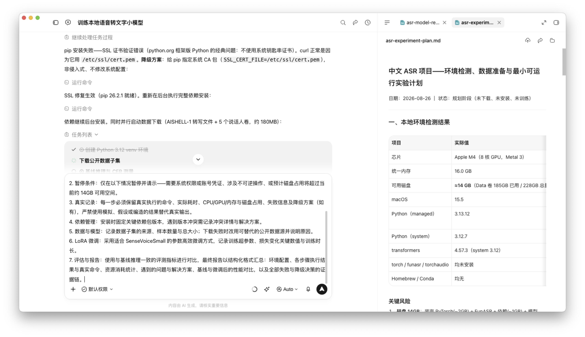
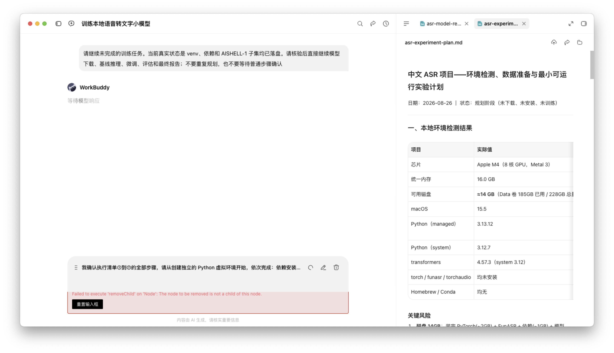
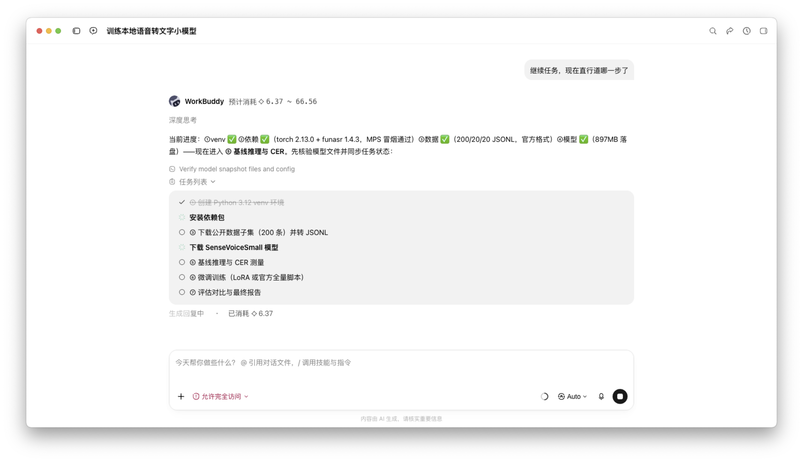
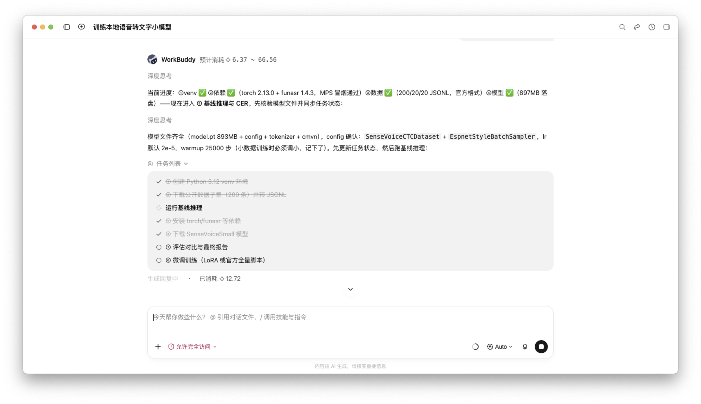
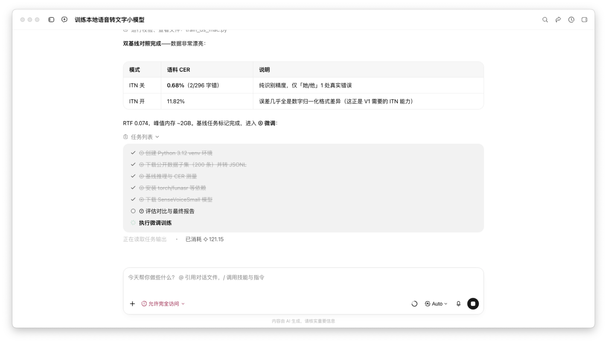
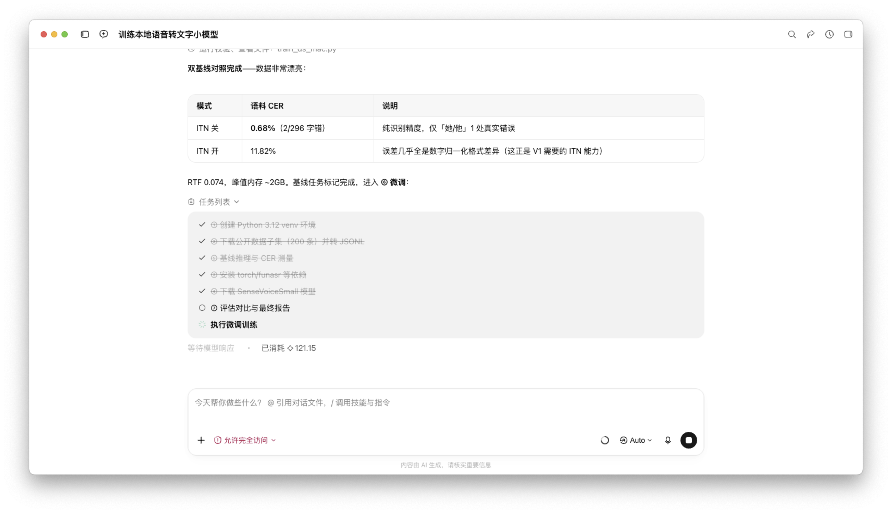
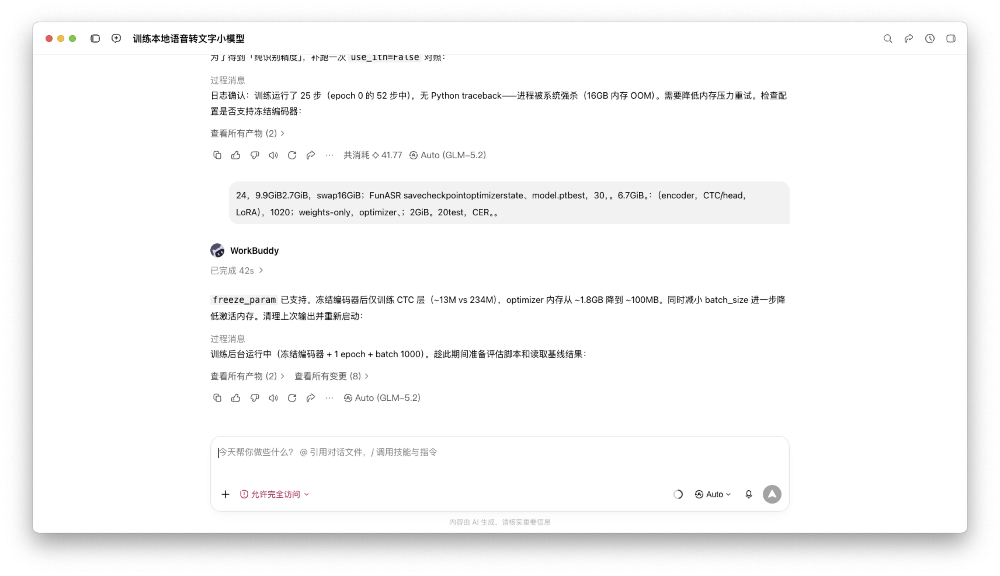
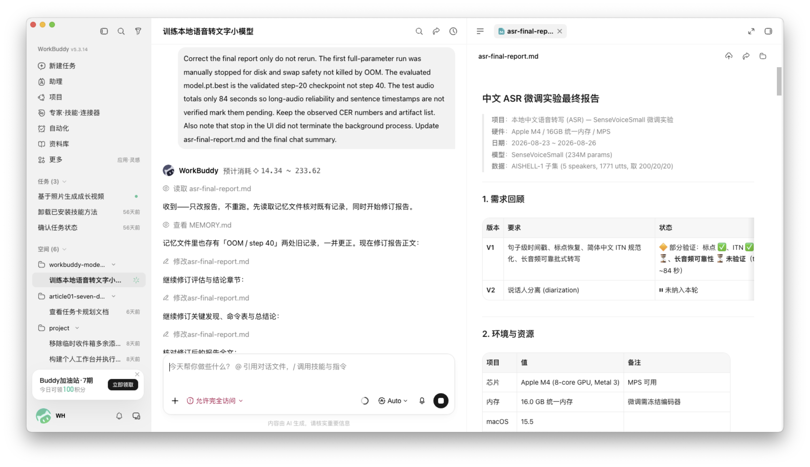

# WorkBuddy 真实执行流程参考：从授权到评测交付

> 状态：完整实验路径证据，2026-08-26；不等于 Specialist Model Studio 已完成产品验收  
> 适用产品：Specialist Model Studio  
> 适用阶段：执行授权、环境准备、模型下载、基线推理、资源降级、微调、评测与报告  
> 关键边界：实验被真实跑通，但微调质量略退化，因此不得自动发布替换基线模型

## 1. 为什么记录这组证据

这组截图不是让 Specialist Model Studio 复制 WorkBuddy 的界面。它们记录了
长时间模型训练任务从授权进入真实执行，经过资源降级、checkpoint、评测和报告后，
**对话、人工授权、后台工具、任务进度、输入草稿和右侧产物同时出现**时的
产品状态。

这组证据对我们的直接价值是：定义一套 AI-human 训练产品必须满足的状态
一致性、可干预性和错误恢复要求。所有结论分为四类：

1. **观察到的事实**：截图中直接可见的内容；
2. **可借鉴模式**：适合本产品目标、但仍需接入真实后端对象的交互结构；
3. **明确缺陷**：截图中已出现的冲突、错误或不可解释状态；
4. **产品需求与验收标准**：转化为 Specialist Model Studio 的可实现规则。

## 2. 证据边界

| Evidence ID | 截图 | 直接覆盖的阶段 | 不可据此推断 |
| --- | --- | --- | --- |
| `WB-E01` | [`01-authorized-execution-stalled-response-w2642.png`](evidence/workbuddy/01-authorized-execution-stalled-response-w2642.png) | pip 失败诊断、证书降级方案、后台安装、公开数据下载、任务列表、计划文档 | 依赖安装成功、数据下载完成、模型已下载或训练已开始 |
| `WB-E02` | [`02-resume-waiting-and-input-error-w2642.png`](evidence/workbuddy/02-resume-waiting-and-input-error-w2642.png) | 用户要求继续、等待响应、输入框异常、计划文档仍停留在规划状态 | 用户陈述的本地状态已经被智能体核验；任何训练或评测结果 |
| `WB-E07` | [`07-deep-thinking-baseline-plan-w7679.png`](evidence/workbuddy/07-deep-thinking-baseline-plan-w7679.png) | 环境、依赖、数据和模型准备摘要；进入基线前的任务状态 | “深度思考”或回复生成本身已经执行了基线 |
| `WB-E08` | [`08-baseline-inference-running-w7679.png`](evidence/workbuddy/08-baseline-inference-running-w7679.png) | 模型 snapshot 检查完成；基线推理进入运行态 | 基线已经结束或指标已经生成 |
| `WB-E09` | [`09-baseline-result-and-training-transition-w7679.png`](evidence/workbuddy/09-baseline-result-and-training-transition-w7679.png) | 双基线 CER、RTF/内存摘要；任务切换到微调 | 微调 Run 已经完成或质量有提升 |
| `WB-E10` | [`10-finetune-running-first-loss-w7679.png`](evidence/workbuddy/10-finetune-running-first-loss-w7679.png) | 对话呈现基线结果、微调处于运行态 | 对话回合状态等于后台训练进程状态 |
| `WB-E11` | [`11-head-only-training-background-step10-w7679.png`](evidence/workbuddy/11-head-only-training-background-step10-w7679.png) | 全量微调内存失败后的冻结 encoder 降级；训练重新在后台运行 | 重启后的训练已完成 40 step 或 checkpoint 已可发布 |
| `WB-E13` | [`14-final-report-corrected-w8201.png`](evidence/workbuddy/14-final-report-corrected-w8201.png) | 基线/微调后对比、事实勘误完成、右侧最终报告打开 | 微调优于基线，或 fine-tuned artifact 已满足发布门 |

展开完整执行阶段主要截图（WB-E07 / E08 / E09 / E10 / E11 / E13）

> 截图 12 的文件名包含 `render-failure`，但复核后该画面并不是渲染故障。
> 本文不把 12 号截图作为失败证据，也不据其文件名推断产品缺陷。

### 证据使用规则

- 截图里的用户陈述是**用户输入**，不是环境事实；只有真实 probe、tool result
  或 task-owned ObjectRef 才能确认环境、数据和模型状态。
- “运行命令”“下载中”“等待模型响应”是界面标签，不等于动作已经完成。
- 右侧 Markdown 是一个产物快照，不自动等于当前 `TrainingTask` 的权威状态。
- 本轮还核对了 WorkBuddy 工作区中的最终报告与训练日志：40 个真实 train step、
  step 20 更新 `model.pt.best`、12.86M 可训练参数和 artifact 大小均来自运行输出，
  不是截图文件名或对话措辞的推断。这些运行产物不进入源码仓库。
- “实验流程执行完成”“评测得出结论”“质量通过发布门”是三个不同状态；本文只确认
  前两者，微调质量门没有通过。

## 3. 观察到的事实

### 3.1 `WB-E01`：授权后的准备阶段

1. 对话区明确报告 pip 因 SSL 证书校验失败，并给出
   `SSL_CERT_FILE=/etc/ssl/cert.pem` 的非侵入式降级方案。
2. 对话区随后声明“SSL 修复生效”，依赖安装继续在后台执行，同时并行启动
   AISHELL-1 转写文件和 5 个说话人卷的下载。
3. 任务列表至少展示了“创建 Python 3.12 venv 环境”已完成，以及“下载公开
   数据子集”处于进行中。
4. 两个“运行命令”入口处于折叠态；截图中看不到完整命令、开始/结束时间、
   退出码、输出摘要或日志引用。
5. 右侧 `asr-experiment-plan.md` 仍显示“规划阶段（未下载、未安装、未训练）”，
   且环境表仍写着 `torch / funasr / torchaudio` 均未安装。
6. 对话区正在呈现执行进展时，底部 composer 仍保留一段很长的授权文本和发送
   控件。截图无法说明这段文本是已接受的请求、待发送草稿还是排队中的下一条请求。
7. 右侧计划文档保留了环境检测表格，为用户提供了一个比聊天文本更适合浏览
   的结构化信息面。

### 3.2 `WB-E02`：继续执行与输入恢复阶段

1. 用户已发送一条明确的继续请求，要求先核验 venv、依赖和 AISHELL-1 子集，
   再继续模型下载、基线推理、微调、评测和最终报告。
2. 智能体区域只显示“等待模型响应”，没有说明正在核验哪个对象、已等待多久、
   最后一次事件、是否仍有后台进程或如何取消/重试。
3. composer 同时显示另一段较长的执行授权文本、旋转中的状态以及编辑/删除控件。
   因此界面同时存在“已发送的继续请求”和“尚未确定语义的另一条输入”。
4. composer 出现明确前端错误：
   `Failed to execute 'removeChild' on 'Node': The node to be removed is not a child of this node.`
5. 错误区只提供“重置输入框”；截图没有证明重置会保留用户草稿、不会影响当前
   请求，也没有可见的错误 ID、Trace ID 或“重试原操作”。
6. 右侧计划文档仍显示“未下载、未安装、未训练”，与用户输入所声称的“venv、
   依赖和 AISHELL-1 子集均已落盘”冲突；截图没有显示智能体完成了核验或给出
   差异结论。
7. 两张截图之间未出现模型下载、基线推理、微调、评测或交付产物的完成证据。

### 3.3 `WB-E07` / `WB-E08`：准备完成并进入基线

1. 对话摘要显示 venv、依赖、数据和模型已完成，并给出可核对的版本/规模：
   `torch 2.13.0`、`funasr 1.4.3`、MPS 冒烟通过、`200/20/20` JSONL，模型约
   897MB 落盘。
2. `WB-E08` 进一步显示模型 snapshot 组成：`model.pt` 893MB，加上 config、
   tokenizer 和 cmvn；任务列表将“运行基线推理”置为进行中。
3. “深度思考”“生成回复中”描述的是对话模型状态；只有真实推理进程、日志和输出
   ObjectRef 才能证明基线动作完成。

### 3.4 `WB-E09`：基线评测完成

1. 同一 20 条测试集上，ITN-off 语料 CER 为 **0.68%（2/296）**；ITN-on 为
   **11.82%（35/296）**。
2. ITN-on 的主要差异来自数字归一化格式，而不是同等数量的纯识别错误，因此产品
   不能只显示单一 CER，还必须解释评测模式和文本规范。
3. 界面同时给出 RTF 0.074、峰值内存约 2GB，并把基线任务标记完成、微调置为
   进行中。这是一个自然的“结果 → 下一阶段”转场模式。

### 3.5 `WB-E10` / `WB-E11`：资源失败、取消边界与降级训练

1. 首次全量微调在 16GB 统一内存环境中产生显著内存/swap 压力。为避免后续
   checkpoint 写盘耗尽磁盘，本轮在约 25 step 时由人工主动终止，并非系统 OOM
   强杀；训练进程没有 Python traceback。该风险同时放大了 checkpoint 与
   optimizer state 的磁盘峰值。
2. 本轮实际观察到：结束或取消对话回合后，已经派生的后台训练进程仍继续运行。
   因此“对话已取消/已完成”不能投影为“训练已取消/已完成”。
3. 降级策略冻结 encoder，只训练 CTC head 与小型 embedding，共
   **12,862,175 个可训练参数（约 12.86M，占 234M 总参数约 5.5%）**，并降低 batch
   带来的激活内存。
4. 降级 Run 产生 **40 个真实 train step**；日志在 step 20 更新
   `model.pt.best`，step 40 仍产生训练/验证和 checkpoint 事件。40/123 是部分 epoch，
   不能被文案抹平成“完成整个 epoch”。
5. `WB-E11` 中 WorkBuddy 的对话回复已显示“已完成 42s”，但正文又说明“训练后台
   运行中”。这正面证明对话回合完成与后台 Run 完成必须使用两套状态。

### 3.6 `WB-E13`：评测结论、artifact 与最终报告

1. 从 step-20 best checkpoint 导出的 weights-only artifact 为 **893MB**；完整 best
   checkpoint 约 991MB，包含优化器等恢复状态。两者生命周期和用途不同。
2. 在相同 20 条测试集上，微调后 ITN-off CER 为 **1.01%（3/296）**，相对基线
   退化 **+0.33 个百分点**；ITN-on 为 **12.16%（36/296）**，退化
   **+0.34 个百分点**。
3. 这次微调验证了本机训练技术路径，但没有证明模型质量提升。fine-tuned weights
   只能是候选 artifact，不能替换基线或被标记为“发布成功”。
4. 最终画面左侧保留对话总结和三方 CER 对比，右侧打开
   `asr-final-report.md`，展示需求回顾、环境资源和后续报告内容。该“对话结论 +
   右侧可审阅产物”结构比把完整报告塞进聊天更适合复杂训练结果。
5. 最终报告可见不等于报告已经进入 Specialist Model Studio 的 task-owned
   `EvaluationReport` / `ArtifactBundle`，持久化、重入、发布和回滚仍需产品侧验收。

## 4. 可借鉴的模式

| 模式 | 为什么有价值 | Specialist Model Studio 的采用方式 |
| --- | --- | --- |
| 对话主线 + 按需右侧产物 | 用户在对话里决策，在更稳定的表格/文档里查看复杂信息 | 对话负责意图、决定摘要和下一步；workspace 只展示 task-owned ObjectRef，不建立第二套流程 |
| 失败后解释原因和降级方案 | 用户知道失败在哪里，也能理解为什么可以继续 | 失败消息包含影响、可逆修复、权限变化和后续动作；修复本身仍必须对应真实 ActionEvidence |
| 长任务拆为可读任务列表 | 能降低“黑盒等待”的焦虑 | 列表由持久化 `work_items` / tool actions 投影；不由前端预设步骤或定时器生成 |
| 允许依赖安装与数据下载并行 | 合理缩短等待时间 | 显示真实依赖图、并行分支和各自状态；其中一支失败不得把另一支渲染为成功或取消 |
| 执行中仍可输入 | 用户可以补充约束、要求暂停或纠偏 | composer 保持可用，但输入必须明确是“干预当前执行”“排队到本轮后”还是“停止并替换” |
| 环境报告作为可查看产物 | 适合承载芯片、内存、磁盘、Python 和依赖兼容信息 | 产物带版本、生成时间、基于哪些 probe、是否已过期，以及从当前状态重新核验的入口 |
| 阶段结果直接驱动下一阶段 | 基线表出现后自然进入微调，用户能理解为什么继续 | 只有真实 EvaluationRun 完成并生成结果对象后才解锁下一阶段；转场保留输入、数据和指标 lineage |
| 资源失败后给出降级策略 | 把“本机跑不了”转成冻结参数、减小 batch 等可解释方案 | 先生成 ResourceFitReport 和新 plan revision，再由用户确认会改变质量/时间/可训练参数的策略 |
| 对话摘要 + 右侧最终报告 | 左侧适合给结论和下一步，右侧适合浏览完整指标、环境和产物 | 对话只投影 verdict 与差异；workspace 打开 task-owned EvaluationReport，并能回到 Run、checkpoint 与样本 |
| 基线/微调后三方对比 | 直接揭示训练是否真的改进 | 评测表同时展示基线、候选、绝对差值、gate verdict；不能只展示 loss 或“训练完成” |

## 5. 明确缺陷及产品影响

| Priority | 缺陷 | 证据 | 用户影响 |
| --- | --- | --- | --- |
| P0 | 同一屏出现互相冲突的执行真相 | `WB-E01` 左侧称后台安装/下载已启动，右侧仍称未安装、未下载；`WB-E02` 冲突继续存在 | 用户无法判断任务是否真的在运行，也无法决定是等待、重试还是重新开始 |
| P0 | 活跃请求、待发送草稿和排队请求没有身份区分 | `WB-E01` 执行中 composer 保留整段授权文本；`WB-E02` 已发送继续请求时 composer 又出现长文本和旋转状态 | 容易重复授权、重复执行或错误覆盖当前任务 |
| P0 | 输入框错误与任务执行边界不清 | `WB-E02` 出现 DOM `removeChild` 错误，仅提供“重置输入框” | 用户担心重置会丢草稿、终止任务或重复提交；无法安全恢复 |
| P0 | 后台动作缺少可核验回执 | `WB-E01` 只见折叠“运行命令”和自然语言结论 | 无法核对真实命令、耗时、退出码、日志和对象归属，不能形成可审计证据链 |
| P1 | “等待模型响应”没有可操作信息 | `WB-E02` 没有当前操作、耗时、最后事件和恢复动作 | 长任务看起来像卡死，用户只能反复发送“继续” |
| P1 | 计划产物没有快照/新鲜度语义 | 两张图右侧均保持原规划状态 | 旧计划容易被误读为当前运行状态；用户看不到计划与真实执行的偏差 |
| P1 | 授权范围没有压缩成可复查对象 | 授权内容以长段文本留在 composer | 用户无法快速确认已授权到哪一步、暂停条件是什么、后续动作是否越权 |
| P2 | 技术过程与用户下一步竞争注意力 | 命令入口、任务列表、长文本和右侧文档同时出现 | 对非算法用户的信息负担过高，真正需要用户处理的事项不突出 |
| P0 | 对话生命周期与后台 Run 生命周期混用 | `WB-E11` 回复显示已完成，但正文说明训练仍在后台运行 | 用户会在仍占用算力/磁盘时误以为任务结束，或在真实 Run 完成前进入评测 |
| P0 | 取消没有级联到派生进程 | 本轮取消/结束对话后，后台训练进程继续运行 | 出现孤儿进程、持续占用内存/swap/磁盘，重复重试还可能启动第二个 Run |
| P0 | “执行完成”容易被误读为“质量成功” | `WB-E13` 已生成最终报告，但微调 CER 从 0.68%/11.82% 退化到 1.01%/12.16% | 若自动发布会把更差模型替换线上基线，且缺少可信回滚点 |
| P1 | checkpoint 峰值未作为一等资源预算 | 全量微调同时承受模型、梯度、optimizer、swap 和 checkpoint 写入压力 | 训练在保存点才突然耗尽磁盘或内存，之前的资源 probe 失去意义 |
| P1 | 部分训练被总结成笼统完成 | 真实 Run 只有 40/123 step，best 来自 step 20 | 用户无法区分完整计划、受控提前停止和仅验证可行性的短跑实验 |

## 6. 转化为 Specialist Model Studio 的产品需求

### `WB-R01` 唯一任务真相源（P0）

- `TrainingTask`、`AgentRun`、`ActionEvidence`、`ObjectRef` 与
  `HumanCheckpoint` 是权威对象；对话文本和 Markdown 只能投影这些对象。
- 页面顶部状态、对话动作、任务列表和 workspace 必须从同一版本的任务状态派生。
- 旧报告必须标记“快照 · 生成于 … · 已过期/当前”，不能与实时状态并列却不解释。
- 当用户描述的本地状态与 probe 不一致时，智能体先展示差异，再询问或执行修复；
  不采信输入，也不静默覆盖。

### `WB-R02` 请求、草稿与队列的身份模型（P0）

- 每次发送生成不可变的 `turn_id` / `request_id`；当前请求、编辑中草稿和排队
  请求必须具有不同对象与视觉状态。
- 执行中再次发送时，只允许三种明确语义：`干预当前执行`、`排队到本轮后`、
  `停止当前执行并替换`。默认不得隐式替换或重复提交。
- 已接受的授权文本从 composer 移除，转为对话中的紧凑授权卡；用户草稿独立持久化。
- 模型或“提示增强”不得在未确认时把简短输入改写成另一条长指令并自动提交。

### `WB-R03` 结构化授权对象（P0）

- 高成本或有风险的执行前，创建 `ApprovalEvidence`，至少记录：批准人、批准时间、
  计划 digest、允许步骤、资源上限、网络/文件权限、必须暂停的条件和撤销状态。
- 执行器只能消费批准范围内的 plan revision；计划、资源或权限变化必须创建新
  revision 并重新确认。
- 对话中显示“已授权：环境 → 数据 → 模型 → 基线 → 微调 → 评测”，并提供
  “查看范围 / 撤销未开始步骤”，避免反复展示整段授权原文。

### `WB-R04` 后台 Action 回执与心跳（P0）

- 每个真实动作至少展示：动作名、负责智能体、`action_id`、开始时间、真实耗时、
  状态、最后事件、输入/输出 ObjectRef。
- 技术详情按需展开，包含脱敏命令、工作目录、退出码、输出摘要、完整日志引用和
  资源使用；没有这些事实时不得显示“命令已执行”。
- 后台任务必须产生心跳或明确的可观测事件。界面不得用定时器伪造进度。
- “等待模型响应”替换为可解释状态，例如“训练协调器正在核验依赖清单 · 42 秒 ·
  最后事件 14:22:08”，并提供与真实生命周期一致的暂停、取消或重试入口。

### `WB-R05` 并行任务与依赖关系（P1）

- 并行安装和下载显示为同一计划下的两个真实 work item，各自有独立状态和证据。
- 下游“模型下载/基线推理”只在前置条件实际通过后解锁。
- 一个分支失败时，系统说明对其他分支的影响和可继续范围，不把整个计划错误地
  渲染为成功、失败或完成。

### `WB-R06` 输入故障隔离与恢复（P0）

- composer 故障不能改变正在运行的 `AgentRun`、Action 或队列。
- 草稿至少以任务和草稿 ID 持久化；刷新、关闭错误或重建编辑器后可以恢复。
- “重置输入框”必须明确只重建编辑器，并在执行前显示“不会取消当前任务，也不会
  重新提交”；若会丢失部分草稿，必须先预览和确认。
- 错误卡记录 error type、时间、关联 request/draft ID、Trace ID（若有）、重试目标；
  “重试”恢复原操作，不能插入一条合成的“请继续”消息。

### `WB-R07` 计划快照与当前执行状态分层（P1）

- 右侧计划文件是不可变 plan revision，顶部显示版本、digest、批准状态与生成时间。
- 当前环境、下载、Run 和评测状态从各自 canonical object 展示，不能回写或伪装成
  计划正文。
- 当现实偏离计划时，workspace 显示“计划值 / 当前值 / 差异 / 决策”，并允许回到
  产生该差异的 Action。

### `WB-R08` 用户可理解的进度摘要（P1）

- 默认对话只回答四件事：刚完成什么、现在做什么、遇到什么问题、是否需要用户。
- 证书、命令和依赖冲突进入可展开证据，不用长技术段落淹没下一步。
- 若不需要人工处理，不生成“等待你的确认”；若确实需要处理，问题、推荐选项、
  影响和默认安全动作必须位于同一 checkpoint 卡。

### `WB-R09` 对话回合与后台 Run 双生命周期（P0）

- `AgentTurn`、`AgentRun`、`TrainingRun` 和 worker process 必须拥有独立 ID 与状态，
  并通过显式 lineage 关联，不能用一枚“完成”徽标覆盖四层生命周期。
- 对话回复完成只表示本轮总结已落盘；只要 TrainingRun 仍为 queued/running/
  cancelling，任务就继续显示真实运行态和资源占用。
- 后台 Run 达到 terminal state 后，由独立事件触发评测或下一轮对话，不依赖用户发送
  “继续”来重新发现进程。
- 40/123 step 这类提前停止必须显示 `stopped_with_checkpoint` 或等价状态，并保留
  planned steps、actual steps、stop reason、best step 和可恢复 checkpoint。

### `WB-R10` 级联取消与孤儿进程回收（P0）

- “停止 Agent”与“取消训练”是两个不同动作；界面必须说明作用域。用户选择取消
  整个任务时，取消沿 `task → agent_run → training_run → worker/process group` 级联。
- cancel 首先进入 `cancelling`，只有 worker 退出、GPU/MPS/CPU 资源释放、日志 flush
  和临时写入收敛后才能进入 `cancelled`。
- 超过 grace period 仍存活的进程升级终止，并生成包含 PID/process group、退出信号、
  未完成写入和保留 checkpoint 的 `CancellationEvidence`。
- 服务重启时执行 orphan reconciliation：识别没有活跃 Run owner 的 worker，禁止在
  用户未知的情况下继续占用资源或与新 Run 并发写同一目录。

### `WB-R11` checkpoint 峰值资源预算（P0）

- ResourceFitReport 不只估算稳定训练占用，还必须预算峰值：模型权重、梯度、
  optimizer state、激活、MPS unified memory、swap、临时 checkpoint、best copy、
  weights-only 导出和保留的安全磁盘余量。
- 训练前显示 `steady / checkpoint peak / export peak / required free after run` 四个预算，
  任一超出批准上限则 blocked 或生成降级 revision，不得先跑到 OOM 再解释。
- checkpoint 采用临时文件 + 原子 rename，写入前重新 probe 磁盘；失败不得覆盖最后
  一个可加载 best checkpoint。
- retention policy 明确 `keep_nbest`、周期 checkpoint、optimizer checkpoint 和
  weights-only artifact 的差别；893MB weights-only 不能冒充 991MB 可恢复 checkpoint。

### `WB-R12` 评测、发布与回滚门（P0）

- `execution_completed`、`evaluation_completed`、`quality_gate_passed`、`release_approved`
  和 `published` 是连续但独立的状态。
- EvaluationReport 必须在同一固定测试集、同一文本规范下对比基线与候选，并展示
  绝对差值、失败样本、资源变化和 gate verdict。
- 本轮候选从 0.68%/11.82% 退化到 1.01%/12.16%，因此应进入
  `evaluation_complete_release_blocked`；默认继续服务基线模型。
- 发布创建不可变 ReleaseCandidate 并绑定精确 weights digest、Recipe/Data/Run/
  Evaluation lineage。只有人工批准精确 digest 后才改变 active release pointer。
- 回滚只切换到已有已验证 release pointer，不删除候选、基线或评测证据；回滚动作
  本身需要权限、原因和可审计记录。

### `WB-R13` 对话结论与右侧产物协同（P1）

- 对话负责一句结论、关键数字、质量 verdict 和建议动作；完整 EvaluationReport、
  checkpoint、失败样本与 ArtifactBundle 在右侧 workspace 查看。
- workspace 只因用户点击结果/ObjectRef 或新结果值得审阅而打开；关闭面板不改变任务、
  Run、评测或发布状态。
- 报告中的每个指标可回到 EvaluationRun、输入集合和计算证据；产物中的 checkpoint
  可回到产生它的 step 和训练日志。
- 报告打开、成功渲染和截图 12 的视觉状态都不能充当完成证据；完成只来自 canonical
  object 与 truth classifier。

## 7. 目标状态与动作规则

| 状态 | 对话主叙事 | workspace | composer | 允许的人类动作 |
| --- | --- | --- | --- | --- |
| `awaiting_approval` | 为什么需要授权、推荐范围、风险 | plan revision、资源预算、权限 | 可回答/修改约束 | 批准、修改、取消 |
| `executing` | 已完成、当前动作、下一动作 | 真实 action/work item、日志和对象 | 可干预，默认不替换当前请求 | 暂停、取消、补充约束、排队消息 |
| `waiting_external` | 等待的外部对象、已等待时间、最后事件 | 下载/进程/服务心跳 | 保持可编辑 | 继续等待、重试、改用替代源、取消 |
| `needs_human` | 一个会改变执行路径的问题 | 对应证据与比较项 | 聚焦回答 | 选择、补充、停止 |
| `cancelling` | 正在停止哪些 Run/worker，仍存活哪些进程 | 级联取消树、grace period、资源释放 | 可查看，不重复发起 Run | 升级终止、保留 checkpoint、返回 |
| `stopped_with_checkpoint` | 实际/计划 step、停止原因、best step、能否恢复 | checkpoint、日志、CancellationEvidence | 可讨论后续 | 恢复、评测已保存 checkpoint、结束 |
| `failed_recoverable` | 失败点、影响、推荐恢复 | error、trace、原 action 和 retry lineage | 草稿可恢复 | 重试原动作、修改方案、取消 |
| `blocked` | 不能继续的真实原因 | BlockerEvidence | 可讨论替代方案 | 补权限/资源、改计划、结束 |
| `evaluation_complete_release_blocked` | 实验完成但质量未达标，保留基线 | EvaluationReport、失败样本、候选 artifact | 可继续优化 | 比较、创建新 revision、导出候选 |
| `release_ready` | 质量达标，等待精确版本批准 | EvaluationReport、ReleaseCandidate、digest | 可确认发布 | 批准、拒绝、回到评测 |
| `published` | 当前生效模型与回滚点 | Release、active pointer、运行验证 | 可继续对话 | 观察、暂停、回滚、创建新 revision |

状态转换必须来自 backend event；前端 spinner、composer 是否有文本、右侧文档是否打开，
都不能改变任务状态。

## 8. 验收标准

### A. 授权与执行启动

- **Given** 用户批准一个包含环境、数据、模型、基线、微调和评测的 plan revision，
  **When** 协调器接受批准，**Then** 生成可重入的 `ApprovalEvidence` 和
  `AgentRun`，composer 清除已提交原文，对话显示紧凑授权范围。
- 刷新页面后，批准 digest、未开始/运行中/已完成步骤和相同对象 ID 均保持一致。
- 改变资源上限或执行入口会使原批准失效；系统不得沿用旧批准继续执行。

### B. 后台动作与并行进度

- venv 创建、依赖安装、数据下载分别对应唯一 `action_id`；每个动作都能查看真实
  开始时间、状态、耗时、退出码或等待原因、日志 ObjectRef。
- 安装和下载并行时，UI 展示两个独立 work item 及依赖关系；任一动作状态变化无需
  刷新即可到达界面，并在刷新后保持。
- 30 秒内没有新输出时显示“仍在运行 / 最后心跳 / 已等待”，而不是重新播放进度或
  把任务标成失败。

### C. 真相冲突处理

- 当旧计划写“未安装”而实际 probe 已确认依赖落盘，旧计划标记为“执行前快照”，
  当前环境卡显示 probe 时间和结果；不得同时把两者作为当前状态。
- 当用户声称数据已落盘，协调器必须先执行 task-scoped probe；probe 失败或不完整时，
  明确列出缺失项，不得直接开始训练。

### D. 执行中对话

- 用户在 Run 执行中输入新内容时，composer 显示该内容的处理方式；未经选择不得
  静默替换活跃请求。
- “排队”产生独立 queued request；“干预”产生关联当前 Run 的 intervention；
  “停止并替换”先完成可审计的取消，再启动新 request。
- 连续点击发送或网络重试不能创建重复 Action；幂等键和 request identity 可在证据中核对。

### E. 输入框故障恢复

- 注入等价于 `removeChild` 的编辑器异常后，当前 AgentRun 和后台 Action 继续保持原状态。
- 错误卡显示 draft ID、error type 和恢复动作；执行“重建编辑器”后原草稿恢复，且不会
  自动发送。
- 刷新后仍能查看原错误和活跃请求；重试关联原 operation，不生成合成用户消息。

### F. 结果真实性

- 在真实 Run 完成前，界面不得出现“训练完成”“评测通过”或绿色成功结论。
- `evaluation_complete_release_blocked` 或 `release_ready` 只能由 task-owned
  EvaluationReport / ArtifactBundle / Run evidence 触发；对话总结必须可以回到
  对应 Action 和 ObjectRef。

### G. 对话完成与后台完成

- **Given** 对话回复已经结束但 TrainingRun 仍在运行，**Then** 页面继续显示
  `training=running`、实际 step、最后心跳和资源占用；不得出现任务完成勾或自动评测。
- **Given** Run 在 40/123 step 停止且保留 checkpoint，**Then** 状态为
  `stopped_with_checkpoint`，并显示 best=step 20、actual=40、planned=123 和 stop reason。
- Run 进入 terminal state 后，系统自动投影结果并唤醒协调器，不要求用户发送
  “继续”才能发现完成事实。

### H. 级联取消

- 从任务层点击“取消全部执行”后，所有 descendant agent/tool/training worker 进入
  `cancelling`；在进程、线程或容器实际退出前不能显示 `cancelled`。
- 取消验收必须记录 process group、退出码/信号、日志 flush、临时文件处理和资源释放；
  系统 probe 不再发现对应 worker 才能通过。
- 模拟 graceful cancel 超时后，升级终止只作用于该 Run 的已解析进程组，不误杀其他任务。
- 服务重启后，孤儿扫描能够发现并阻断一个仍存活但无 owner 的训练进程。

### I. checkpoint 与资源峰值

- 在 16GB unified memory 场景，ResourceFitReport 分别显示稳定训练、保存 checkpoint、
  导出 weights-only 时的内存/swap/磁盘峰值和至少 2GiB 安全余量。
- 若全量微调预算超限，开始按钮被阻断，并提供“冻结 encoder（约 12.86M / 5.5%）”
  等新 revision；未经确认不得静默改变可训练参数范围。
- 保存 checkpoint 前磁盘不足时安全失败，最后一个 best checkpoint 仍可加载；临时文件
  不被登记为可交付 artifact。
- 991MB 可恢复 checkpoint 与 893MB weights-only artifact 拥有不同 type、digest、
  retention 和用途说明，下载/发布入口不能互换。

### J. 质量、发布与回滚

- 使用相同 20 条测试集复算后，界面准确显示：基线 0.68%/11.82%，候选
  1.01%/12.16%，差值 +0.33/+0.34 个百分点。
- 质量方向为退化时，EvaluationRun 可以 `completed`，但 quality gate 必须失败，
  ReleaseCandidate 不得变成 active release，任务显示“实验完成，暂不发布”。
- 未经人工批准精确 artifact/evaluation digest，发布 API fail closed；拒绝发布不删除
  checkpoint、评测或报告。
- 发布后回滚测试保留同一 task/run lineage，将 active pointer 恢复到上一已验证基线，
  并生成可审计 rollback record。

### K. 对话与右侧报告

- 最终对话首屏能读到结论、四个 CER 数字、gate verdict 和下一步，不复制整份报告。
- 点击报告 ObjectRef 后打开右侧 `EvaluationReport`；其中指标、失败样本、checkpoint
  和 artifact 均能回到产生它们的 Run/action。
- 关闭/重新打开 workspace、刷新页面和从任务列表重入后，仍打开同一 report ID；关闭
  workspace 不改变 task status。
- 将截图 12 对应的正常通知/渲染画面作为视觉回归样本时，断言它不是 failed 状态；
  文件名中的 `render-failure` 不得驱动产品真相。

## 9. 当前证据覆盖与后续补充门

| 流程阶段 | 当前证据 | 当前结论 | 后续必须补充的证据 |
| --- | --- | --- | --- |
| 授权 | `WB-E01` 长文本授权仍在 composer | 能看到授权内容，但无法证明已形成持久化批准对象 | 批准卡、批准 digest、刷新后状态、撤销/变更路径 |
| 环境准备 | `WB-E01` venv 完成标记与 SSL 修复说明 | 观察到 UI 声明，不足以证明命令结果和持久化 | Action 回执、exit code、日志、环境 probe、重入结果 |
| 数据下载 | `WB-E01` 下载进行中 | 只证明捕获时 UI 呈现进行态 | 下载完成对象、样本/大小/hash、失败与重试证据 |
| 执行恢复 | `WB-E02` 继续请求和输入 DOM 错误 | 已确认存在恢复缺陷 | 草稿恢复、活跃 Run 不受影响、retry lineage 的验收截图 |
| 模型下载 | `WB-E07` / `WB-E08` | 897MB snapshot 落盘并核查组成，已进入基线 | 在本产品中仍须保存 resolved revision、license、manifest、digest 与 task-owned ObjectRef |
| 基线推理 | `WB-E08` / `WB-E09` | 20 条测试完成；ITN-off 0.68%，ITN-on 11.82% | 本产品需验证固定测试集策略、结果持久化、重入与 lineage |
| 全量微调失败/取消 | `WB-E10` / `WB-E11` + 运行核查 | 16GB 下发生内存/swap/磁盘峰值风险；约 25 step 时为资源安全人工停止，但对话取消后后台进程仍继续 | 级联取消、orphan 回收和峰值资源预算尚未在本产品实现验收 |
| 降级微调 | `WB-E11` + 训练日志 | 冻结 encoder，12.86M（5.5%）可训练参数；真实 40 step，step-20 best | 本产品需区分 40/123 的受控停止、完整 epoch 与恢复 Run |
| checkpoint / artifact | 训练日志 + `WB-E13` 最终报告 | best checkpoint 约 991MB；weights-only 893MB | 本产品需验证 type/digest、原子保存、retention、下载和发布绑定 |
| 微调后评测 | `WB-E13` | ITN-off 1.01%，ITN-on 12.16%，分别略退化 +0.33/+0.34 个百分点 | 质量 gate、失败样本对象和 release-blocked 状态需产品侧闭环 |
| 最终报告 | `WB-E13` | 对话总结完成，右侧 `asr-final-report.md` 已打开 | task-owned EvaluationReport/ArtifactBundle、刷新重入、导出仍需验收 |
| 发布与回滚 | 无 | **未执行；微调质量退化，不应发布** | ReleaseCandidate、人工 digest 批准、active pointer 与 rollback record |

因此，这组证据现在可以称为“真实端到端实验执行参考”，但不能称为“可发布模型
闭环已经通过”。对 Specialist Model Studio 而言，下一阶段重点不是再做一套相似动画，
而是用真实对象完成：**后台生命周期、级联取消、峰值预算、质量门、发布/回滚和报告
重入**。
